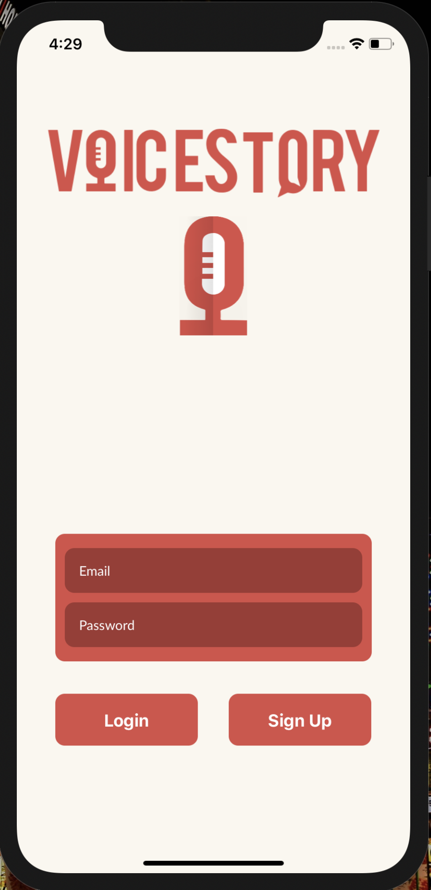
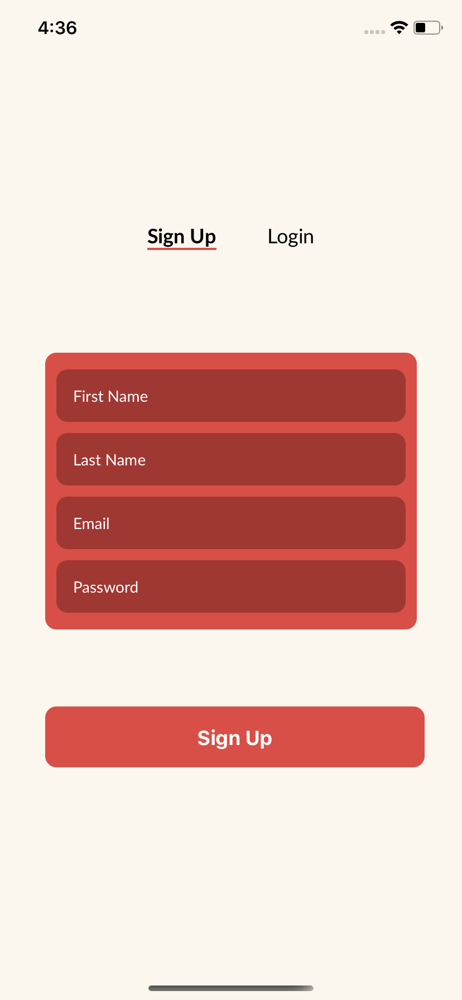
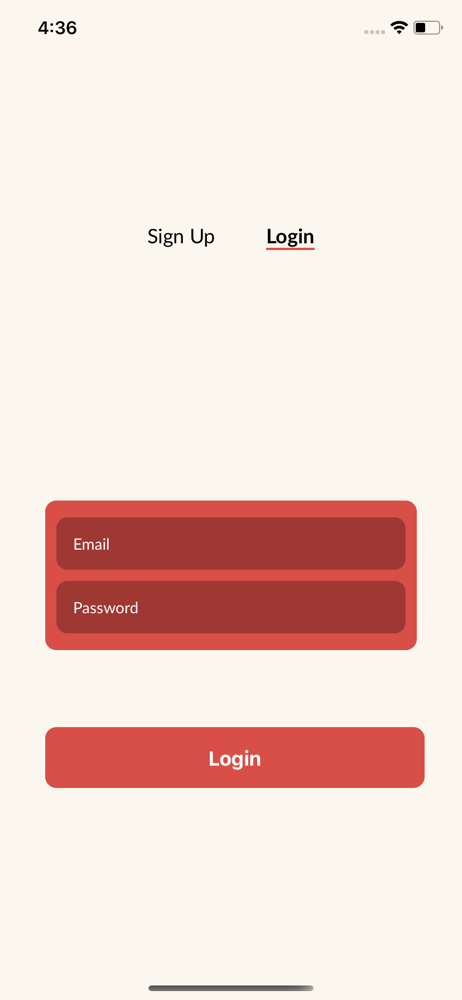
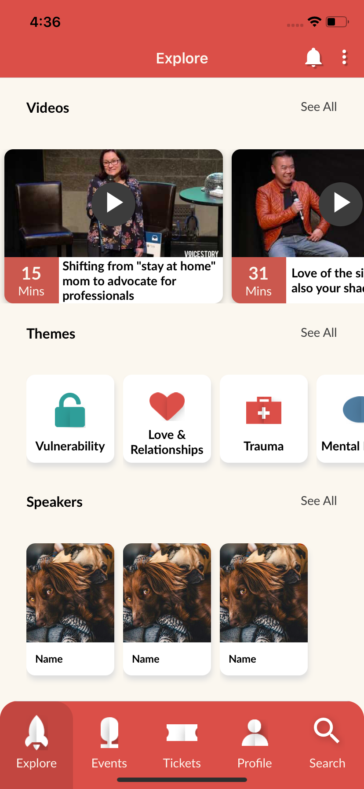
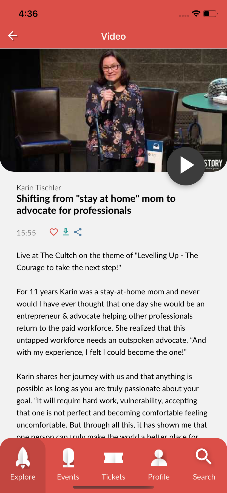
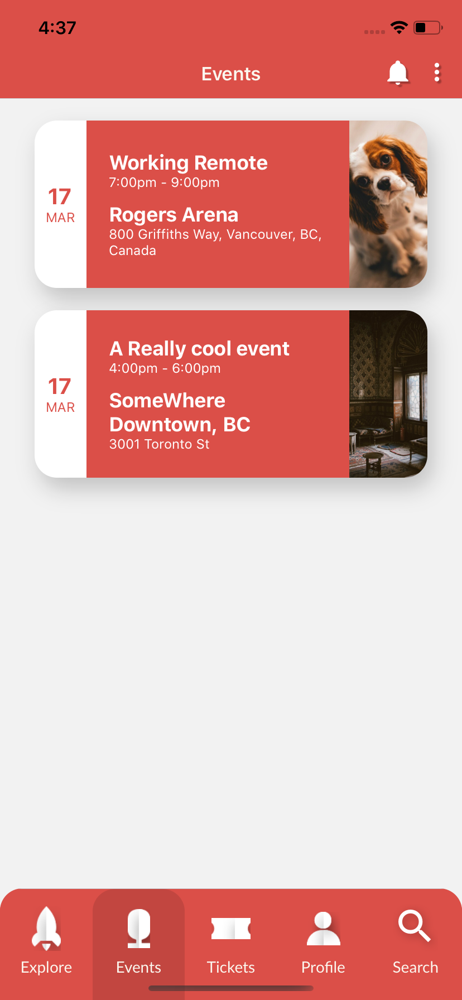
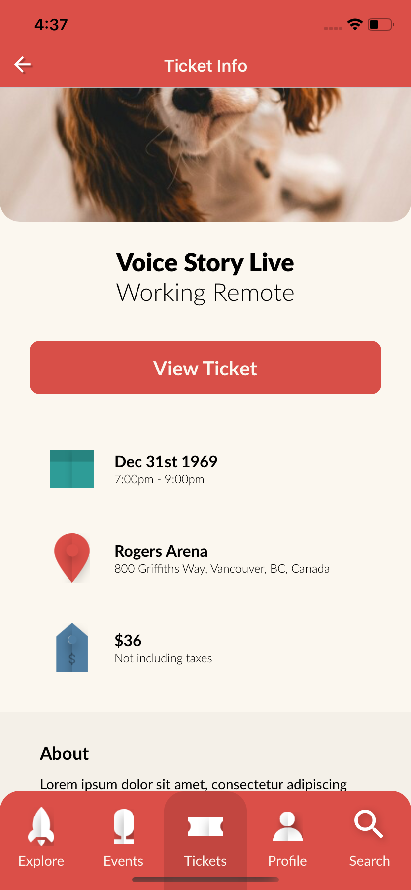

# VoiceStory

## Screenshots









## Project Description

The VoiceStory App allows the user to find speakers and events, past or present, at Voicestory in one mobile React Native application. The user is able to favourite the select video and will be able to read up on the speaker.

### Installation

## Server

```bash
yarn install
cd ios
pod install
```

## Client

```bash
yarn install
```

## Run - (./client)

```bash
yarn ios - IOS Device
yarn android - Android Device
```

## Run - (./server)

```bash
yarn dev
```

## Technologies Used & Key Learnings

- React Native
- GraphQL
- Prisma
- Javascript
- IOS/Android mobile device development
- Mobile App project structure

## Author

- Ivan - https://www.linkedin.com/in/ivan-dai/
- Kieran - https://www.linkedin.com/in/kieran-devlin-a7896a172/
- Ken - https://www.linkedin.com/in/khuang-dev/
- Ian - https://www.linkedin.com/in/ian-doornbosch-21a049138/
